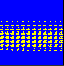

WebGL Unified Particle System
======================

**University of Pennsylvania, CIS 565: GPU Programming and Architecture, Final Project**

- Richard Lee
- Ottavio Hartman
- Tested on:
 * Firefox 49.0.2, Windows 10, i5-3570K @ 3.40GHz 16GB, Radeon HD 7900
 * Google Chrome 54.0.2840.71, Windows 10, FX-8320 @ 3.50GHz 8GB, GTX 1060 3GB

## Overview

WebGL has taken off recently: it is easily accessible and runs with high performance. Unfortunately, its API (currently) only allows access to the graphics card through graphics-only functions, not making it easy to use the computational functionality of graphics cards. Real-time rigid body simulation, for example, would highly benefit from the parallel nature of GPU computation.

We propose a WebGL implementation of a rigid body simulation method which stores rigid body information such as linear velocity, rotational velocity, and forces in textures and uses shaders to perform physics calculations. In addition, this implementation represents rigid bodies as a set of particles, and computes collisions through interactions between these particles. 

The technique detailed in the paper can also be generalized to particles with variable connectivity, allowing for substances like granular materials and fluids. These would be good stretch goals to pursue once we have a solid implementation of the core rigid body simulation in the browser. Since this project will be easily accessible through the browser, we will also be able to implement various interactive controls for the user to manipulate and interact with the scene.

### Milestones

* Basic granular material simulation
* Rigid body simulation
* Fluid simulation
* Unified particle simulation

### Uniform Grid

(Image credit: [NVIDIA Gpu Gems](http://http.developer.nvidia.com/GPUGems3/gpugems3_ch29.html))

### Particle Generation from Mesh

### References
http://learningwebgl.com/blog/?p=1786
http://http.developer.nvidia.com/GPUGems3/gpugems3_ch29.html