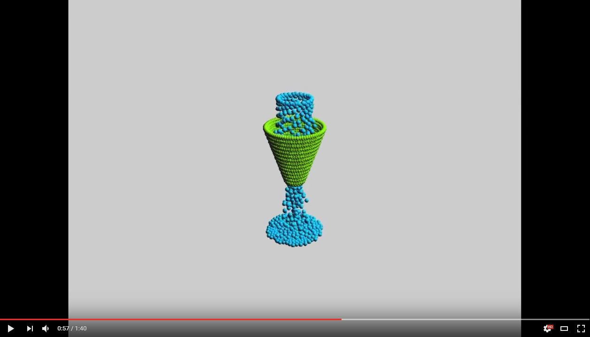

WebGL Unified Particle System
======================

**Richard Lee and Ottavio Hartman**

A unified particle and rigid body simulation in WebGL, inspired by [this GPU Gems article](http://http.developer.nvidia.com/GPUGems3/gpugems3_ch29.html). 

 
Try the live demo [here](https://leerichard42.github.io/WebGL-Unified-Particle-System/). 
This project requires a WebGL capable browser which supports the extensions `OES_texture_float`,
`OES_texture_float_linear`, `WEBGL_depth_texture`, `WEBGL_draw_buffers`, and `EXT_frag_depth`.
>**Controls** 
>`click + drag` : Rotate camera view 
>`right click + drag` : Pan camera view 
>`mouse scroll` : Zoom camera

## Features

### Discrete Element Method
In this simulation, collisions are resolved through the discrete element method (DEM), which models particle collisions as a system of springs and dampers. Each particle has a mass and various collision coefficients which can be used to tune each simulation scene.

In addition, 2D textures were used to store the positions, velocities, and acting forces of each particle - these textures were ping-ponged on each frame to update the simulation using the second order Runge-Kutta method.

From left to right, the textures in the clip represent the positions, velocities, forces, and the uniform grid (discussed below).

### Uniform Grid
In order to increase the performance of the shaders, a uniform grid was created so each particle could search its nearest neighbors when doing physics calculations. The procedure for generating and updating the uniform grid was adapted from [GPU gems](http://http.developer.nvidia.com/GPUGems3/gpugems3_ch29.html).

A 3D texture represents the voxels in the uniform grid, and each pixel stores the index of the particles contained within it. Since WebGL 1 does not support 3D textures, we adapted a mapping from a 3D texture coordinate onto a 2D texture. The 2D texture can be seen below:

The process for updating th
##### Pitfalls

(Image credit: [NVIDIA Gpu Gems](http://http.developer.nvidia.com/GPUGems3/gpugems3_ch29.html))

### Rigid Bodies
Rigid bodies were simulated as a set of particles which were fixed relative to a specific body. The state for a single rigid body is comprised of its center of mass, rotation, linear momentum, and angular momentum. On each frame, the position and velocity for each particle was calculated based on the state of its rigid body and its position relative to the body, before the interparticle forces were calculated as normal. The particle forces for a body were then summed in order to produce a total force and torque, which were used to update the body state.

The rigid body states were stored in their own 2D textures, which interfaced with the particle data through indices stored in the alpha channel of the various state structures.

### Particle Rendering
The particle spheres were rendered in screen space using GL_POINTS, by calculating the point size based on the depth of the point and determining the eye-space sphere normal from the point coordinates.

### Arbitrary Model Loading

## Performance Analysis

- Tested on:
 * Firefox 49.0.2, Windows 10, i5-3570K @ 3.40GHz 16GB, Radeon HD 7900
 * Google Chrome 54.0.2840.71, Windows 10, FX-8320 @ 3.50GHz 8GB, GTX 1060 3GB

### naive vs grid, with increasing # of particles
### performance among scenes

### References
http://http.developer.nvidia.com/GPUGems3/gpugems3_ch29.html //gpu gems
http://learningwebgl.com/blog/?p=1786 //rendering to texture
http://developer.download.nvidia.com/presentations/2010/gdc/Direct3D_Effects.pdf //point rendering

* [Three.js](https://github.com/mrdoob/three.js) by [@mrdoob](https://github.com/mrdoob) and contributors
* [stats.js](https://github.com/mrdoob/stats.js) by [@mrdoob](https://github.com/mrdoob) and contributors
* [webgl-debug](https://github.com/KhronosGroup/WebGLDeveloperTools) by Khronos Group Inc.
* [glMatrix](https://github.com/toji/gl-matrix) by [@toji](https://github.com/toji) and contributors
* [minimal-gltf-loader](https://github.com/shrekshao/minimal-gltf-loader) by [@shrekshao](https://github.com/shrekshao)
